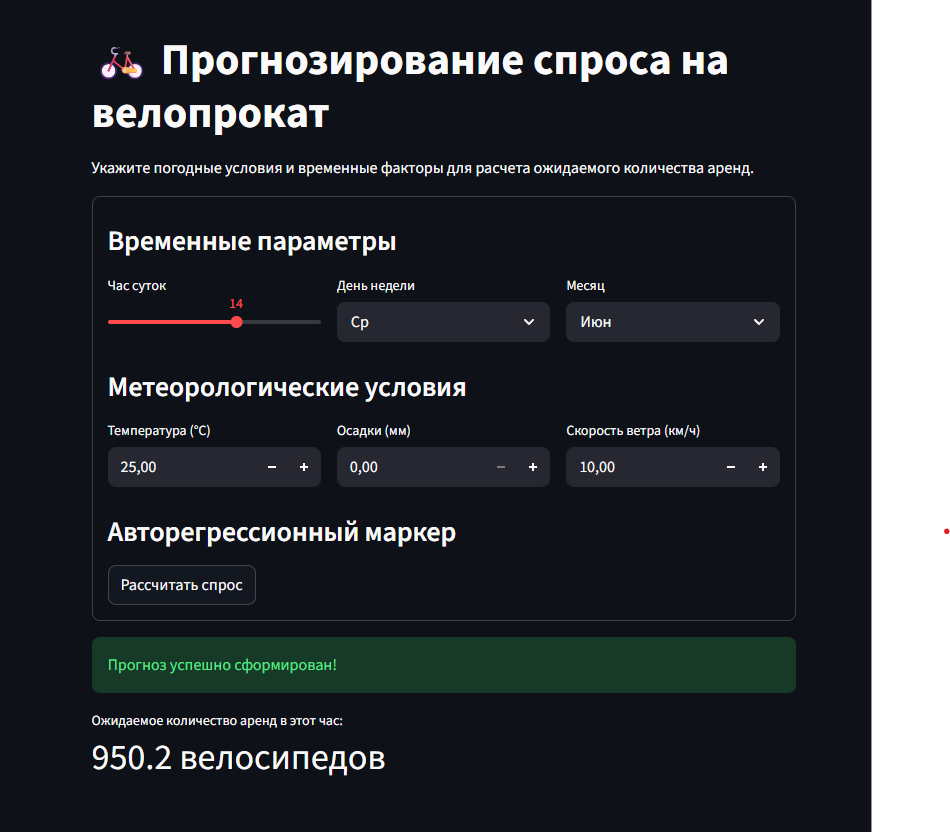

# Отчёт по проекту

**Студент:** Гудкова Ксения Дмитриевна
**Группа:** БИВ238

---

## 1. Введение и постановка задачи

- **Цель проекта:** Целью проекта является разработка предсказательной модели дляпрогнозирования почасового спроса на станциях велопроката в зависимости от метеорологических условий и времени. Практическая ценность заключается в оптимизации логистики: своевременном распределении транспортных средств между станциями, снижении упущенной прибыли в пиковые часы и повышении доступности сервиса для горожан.
- **Формулировка задачи:** Регрессия (целевая переменная непрерывна - количесво поездок)
- **Обоснование метрики качества:** Я использую две метрики качества:
  - MAE: выбрана в качестве основной метрики. Устойчива к единичным крупным выбросам и обладает прямой физической интерпретацией (показывает, на сколько велосипедов в среднем ошибается модель при проргнозе на час)
  - R2: используется как вспомогательная метрика. Приоритет был отдан MAE, так как она нгапрямую отражает бизнес-тркебования проекта. 

---

## 2. Поиск и описание данных

- **Источник данных:** В качестве основы взят открытый датасет исторических логов поездок системы городского велопроката. Для полноценной картины был разработан скрипт парсинга, извлекающий архивные показатели погоды с почасовым шагом через бесплатный API Open-Meteo по географическим координатам города. Выбор обусловлен высокой детализацией обоих источников и их идеальной совместимостью по временным меткам.
- **Описание датасета:**
  - Объём: в финальном датасете 10907 строк и 9 столбцов.
  - Описание признаков (типы, смысл):
    - temp (float) — температура воздуха (°C).
    - precip (float) — количество осадков (мм).
    - wind (float) — скорость ветра (км/ч).
    - hour (int) — час суток (0–23).
    - day_of_week (int) — день недели (0–6).
    - month (int) — месяц (1–12).
    - cnt_log_24h (float) — лаг целевой переменной (спрос ровно 24 часа назад).
    - target (int) — целевая переменная (суммарное число аренд в данный час).
  - Если данных мало - обоснование достаточности или ограничения

---

## 3. Обработка и подготовка данных

- **Полная очистка:**
  - Пропуски: Обнаружены с помощью метода .isnull().sum(). Строки с пропусками в целевой переменной started_at удалялись на этапе агрегации. В погодных данных от API Open-Meteo пропусков изначально не было.
  - Дубликаты: Полные дубликаты записей поездок отсекались на этапе первичной загрузки логов с помощью метода .drop_duplicates().
  - Выбросы: Для обнаружения аномальных всплесков спроса применялся метод фильтрации по верхнему квантилю. Строки, где target превышал строгое пороговое значение 99.9-го перцентиля, были удалены.
  - Типы данных: Временная метка started_at принудительно приведена к типу datetime64 и округлена до часа (dt.round('h')) для корректного слияния с базой метеоданных.
- **Работа с фичами:**
  - Исходное количество признаков: 4 базовых параметра (время и сырые метеоданные: температура, осадки, ветер).
  - Новые фичи, feature engineering (какие созданы и зачем): Созданы календарные фичи (hour, day_of_week, month) для фиксации циклов жизнедеятельности города. Создан авторегрессионный признак cnt_lag_24h (.shift(24)) — объем спроса сутки назад, отражающий базовый уровень популярности станций в аналогичный период.
- **Визуализации:** В файле 01_eda.ipynb были построены следующие графики:
  - График распределения данных (чтобы убедиться, что очистки прошли успешно)
  - График распределения спроса по часам (выделяет часы-пик использования велопроката)
  - Графики зависимости от погодных условий (необходимо чотбы выявить как погодные условия влияют на спрос)
- **Сплит данных:**
  - Стратегия разбиения (train/val/test), соотношение: Использовался строгий хронологический сплит (данные отсортированы по времени): первые 80% выборки направлены в Train, последние 20% — в Test. Соотношение 80/20.
  - Как избегали data leakage (если он мог возникнуть - временные ряды, утечка целевой и т.д.): Случайный K-Fold сплит был исключен, так как перемешивание привело бы к заглядыванию в будущее. Лаговый признак cnt_lag_24h рассчитывался со сдвигом назад, поэтому на тесте модель оперирует исключительно данными из физического «прошлого». При подборе параметров внутри Train использовался валидатор TimeSeriesSplit, гарантирующий хронологическую чистоту фолдов.

---

## 4. Baseline-модель

- **Модель:** простая модель «из коробки» (Linear/Logistic Regression, KNN и т.п.) без feature engineering: Ridge
- **Результаты:** метрики на val/test:
  - MAE: 115.524
  - R2: 0.583
- **Цель:** Создание простейшей точки отсчета. Baseline показал слабый результат из-за неспособности линейной модели уловить нелинейные зависимости (влияние дождя, жары и часов пик).

---

## 5. Эксперименты

Для каждого эксперимента - формат: **Гипотеза** → **Как проверялось** → **Результат** + метрики в таблице.

- **Минимум 4–5 моделей** + ансамбли (RandomForest, XGBoost/LightGBM и др.)
- **Перебор гиперпараметров:** какие методы использовались и какие параметры перебирали
- **Уменьшение размерности:** если фич много - эксперименты с PCA/другими методами, визуализация
- **Таблица экспериментов:** пример как может выглядеть таблица 

### Эксперемент 1

- **Гипотеза**: Спрос на велосипеды в схожие часы и при похожей погоде должен быть близок. Метод К-ближайших соседей сможет уловить локальные нелинейности.
- **Как проверялось**: Обучен KNeighborsRegressor(n_neighbors=5) в пайплайне со StandardScaler.
- **Результат**: Метрики улучшились по сравнению с Baseline, но модель страдает от шумов.

### Эксперемент 2

- **Гипотеза**: Случайный лес из коробки эффективно справится с нелинейными пороговыми признаками (например, дождь/сухо) без предварительного масштабирования.
- **Как проверялось**: Обучен RandomForestRegressor(n_estimators=100, random_state=42).
- **Результат**: Зафиксировано существенное падение MAE. Модель успешно выделила логику часов пик и температурных диапазонов.

### Эксперемент 3

- **Гипотеза**: Градиентный бустинг со стратегией построения деревьев по уровням (Level-wise) обеспечит сильный и устойчивый результат со стандартными параметрами.
- **Как проверялось**: Обучен стандартный XGBRegressor().
- **Результат**: Показал лучший результат среди всех моделей «из коробки».

### Эксперемент 4

- **Гипотеза**: LightGBM из коробки отработает быстрее и точнее за счет гистограммного метода и роста по листьям (Leaf-wise).
- **Как проверялось**: Обучен стандартный LGBMRegressor().
- **Результат**: Модель уступила базовому XGBoost по MAE. Причина: стратегия Leaf-wise без явного ограничения глубины (max_depth=-1) на дефолтных настройках привела к легкому переобучению под шумы трейна.

### Эксперемент 5

- **Гипотеза**: Жесткое ограничение глубины и подбор темпа обучения через кросс-валидацию устранят переобучение LightGBM и выведут модель в лидеры.
- **Как проверялось**: Проведен GridSearchCV с валидацией TimeSeriesSplit(n_splits=3) по сетке: max_depth: [5, 10, -1], learning_rate: [0.05, 0.1], n_estimators: [100, 200].
- **Результат**: Результат получился ниже из-за проявившегося недообучения.

| Модель            | Гипотеза                              | Параметры               | MAE | R2  | Комментарий |
|-------------------|---------------------------------------|-------------------------|-----|-----|-------------|
| Ridge             | Точка отсчета                         | defolt + StandardScaler | 115.524 | 0.582806 | ...         |
| KNN               | Схожая погода — схожий спрос          | n_neighbors=5           | 94.2891 | 0.700058 | ...         |
| RandomForest      | Ансамбль деревьев уберет нелинейность | n_estimators=100        | 83.628 | 0.723937 | ...         |
| XGBoost           | Level-wise рост устойчив к шуму       | defolt                  |  72.8895 |0.794206 | ...         |
| LightGBM (defolt) | Leaf-wise рост обеспечит точность     | defolt                  | 73.8389 | 0.79361 | ...         |
| LightGBM (tuned)  | Тюнинг параметров уберет переобучение | max_depth=5, lr=0.05, n_est=200 | 87.63 | 0.740 | ...         |

---

## 6. Финальная модель и интерпретируемость

- **Обоснование выбора финальной модели:** В качестве финального производственного решения выбрана модель **XGBoost (из коробки)**. Она продемонстрировала минимальную среднюю абсолютную ошибку (**MAE: 72.89**) и объяснила **79.42%** дисперсии данных на отложенном тестовом интервале, превзойдя все остальные алгоритмы. Модель сохранена в файл `models/best_model.pkl`.
- **Интерпретируемость:** Анализ встроенного свойства важности признаков показал следующую структуру влияния факторов:
  - `cnt_lag_24h` и `hour` — удерживают абсолютное лидерство. Спрос жестко завязан на суточные циклы города и авторегрессионный паттерн предыдущего дня.
  - `temp` — ключевой метеорологический предиктор, корректирующий базовую амплитуду предсказания.
  - `day_of_week` — позволяет модели разделять логику распределения поездок на утилитарную (будничные часы пик) и прогулочную (выходные дни).

---

## 7. Деплой

- **Интерфейс:** если требуется по задаче (Streamlit, Telegram-бот и т.д.)
  - Для демонстрации работы модели разработан легковесный веб-интерфейс на фреймворке Streamlit. Основная задача предоставить пользователю интуитивно понятную форму для ввода внешних параметров: календарных факторов (час, день недели, месяц) и метеорологических условий (температура, осадки, скорость ветра).
- **API:** FastAPI или аналог - описание эндпоинтов, примеры запросов
  - Вычислительное ядро системы реализовано как веб-сервер на базе фреймворка FastAPI. Особенности:
    - Входные данные строго типизированы и валидируются с помощью моделей `Pydantic`. В случае некорректного формата (например, передачи текста вместо координат погоды) API автоматически возвращает структурированную ошибку
    - При поступлении запроса FastAPI извлекает переданные параметры времени, обращается к срезу исторической базы данных и автоматически рассчитывает среднее значение спроса за аналогичный период (`cnt_lag_24h`). Полученная фича скрытно подставляется в DataFrame перед инференсом XGBoost.
  - Эндпоинты:
    - **`GET /health`** — Проверка работоспособности сервиса. Возвращает JSON `{"status": "alive", "model_loaded": true}`.
    - **`POST /predict`** — Основной эндпоинт для инференса модели.
- **Скриншоты** работы интерфейса/API

- **Ссылка на видео** демонстрации работы https://disk.360.yandex.ru/i/uLzMpyK6uUL1uw
---

## 8. Заключение и выводы

- **Итоги:** достигнутые результаты, сравнение с baseline
  - В ходе выполнения проекта был реализован полный цикл разработки интеллектуальной системы прогнозирования — от сбора и предобработки сырых данных до развертывания готового микросервисного приложения в контейнерах Docker.
  - Основные результаты:
    - **Интеграция внешних источников:** Успешно настроен автоматический сбор метеорологических данных через API Open-Meteo, что позволило обогатить исторические логи поездок ключевыми физическими предикторами (температура, скорость ветра, осадки).
    - **Превосходство над Baseline:** Разработанная финальная модель на базе алгоритма градиентного бустинга **XGBoost** показала значительный прирост качества по сравнению с базовым решением.
    - **Готовность к продакшену:** Сервис упакован в архитектуру FastAPI + Streamlit. Логика расчета сложных авторегрессионных признаков полностью инкапсулирована на бэкенде, обеспечивая пользователю максимальную простоту взаимодействия с системой.
- **Ограничения:** что не удалось, почему
  - **Зависимость от исторического файла:** В текущей локальной версии FastAPI использует статический CSV-файл для извлечения суточных лагов спроса (`cnt_lag_24h`). Если пользователь запросит прогноз на дату, которой физически нет в этом файле, бэкенд откатится к дефолтному среднему значению, что снизит точность инференса.
  - **Отсутствие учета внешних аномалий:** Модель опирается исключительно на календарь и погоду. Она не знает расписания городских культурно-массовых мероприятий, ремонтных работ на дорогах или забастовок общественного транспорта, которые могут локально ломать привычные паттерны спроса.
  - **Хронологический сдвиг:** Модель обучалась на фиксированном историческом интервале. Со временем городская инфраструктура меняется (открываются новые станции проката, меняются тренды), из-за чего точность старой модели будет неизбежно деградировать.
- **Возможные улучшения:** идеи для дальнейшей работы
  - **Интеграция полноценной БД:** Заменить статический файл `final_dataset.csv` на реальную базу данных (например, PostgreSQL).
  - **Автоматический ретрейнинг:** Настроить пайплайн переобучения модели по расписанию на обновляющихся данных, чтобы бороться с эффектом устаревания модели.
  - **Обогащение признакового пространства:** Добавить календарь государственных праздников, переносов рабочих дней, а также гео-фичи (близость станций к метро или паркам), чтобы точнее прогнозировать пиковые нагрузки.
  - **Переход к глубокому обучению:** В качестве эксперимента исследовать рекуррентные нейросети (LSTM/GRU) или специализированные архитектуры трансформеров для временных рядов, чтобы оценить их применимость на долгосрочных горизонтах прогнозирования.
